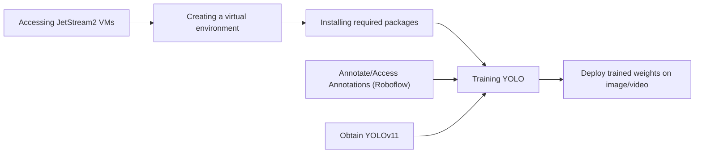

# Bringing It All Together

<br>
<br>
<p align="center">
    
</p>
<br>

---

>[!important]
> :clock1: **Schedule**
> - 2:00pm-2:10pm: Welcome and overview of topic
> - 2:10pm-2:30pm: Installing requirements and setting up environment
> - 2:30pm-end: Executing model!

>[!important]
> :heavy_exclamation_mark: **Requirements**
> - Basic command line knowledge
>- Access to a [Terminal](https://en.wikipedia.org/wiki/Unix_shell)
>    - Unix and Mac users already have access to the Terminal
>    - Windows users can use either [PowerShell](https://en.wikipedia.org/wiki/PowerShell) or the [Windows Subsystem for Linux (WSL)](https://learn.microsoft.com/en-us/windows/wsl/install)
> - A registered CyVerse account (Register for a CyVerse account)

>[!important]
> :white_check_mark: **Expected Outcomes**
> - Refresh required Open Science libraries for image detection
> - Together train and deploy a model 

<br>

---
---

## Overview

Today is the day we bring it all together! Over the course of this and the next workshop (if needed) we are going to take all of the Open Science pieces we have discussed through the [Functional Open Science Skills for AI/ML Applications](https://github.com/ua-datalab/FOSS_AI-ML/wiki) and create and end-to-end ML pipeline that will recognize objects within a photo or a video.

As a summary, here are the contents that we have covered and we are going to be using today:

- [Virtual Environments](https://docs.python.org/3/library/venv.html) (through Python)
- [Where to find compute](https://docs.jetstream-cloud.org/) (through JetStream2)
- Open Source ML libraries ([YOLO](https://docs.ultralytics.com/models/yolo11/)/[Ultralytics](https://docs.ultralytics.com/))
- Tools to build annotations for training, testing and deploying an ML object detector (through [Roboflow](https://roboflow.com/) (requires account)) 

Here's the general overview of what we are going to be doing today:



---

## Virtual Environment

In the past, we've discussed [**Conda**](https://docs.conda.io/en/latest/), an Environment Manager which allows you to create software installation directories that are isolated from other installations. You can create unique environments and install specific software version to run specific scripts.

For this exercise, we are not going to use Conda, but the built in **Python** virtual environment manager [**venv**](https://docs.python.org/3/library/venv.html). We have decided to use venv instead of conda to streamline the workshop and to dilute the amount of downloads we need to make.

To create the Python environment, open the command line and do:

```
python -m venv yolo
```

This will create an evironment called `yolo`. This also creates a folder within the current directory with the same name. This folder will contain all of the python packages you will be installing using `pip` within the environment, isolating these packages from your base environment (*would save your life during actual research!*).

To activate the evironment, do:

```
source yolo/bin/activate
```

You will notice that now your prompt starts with `(yolo) <user>@<machine>`, implying that you've now activated the `yolo` environment. **You will have to do this for every single CLI terminal you open, unless specified in `~./bashrc`**.

## Environment Setup

**[Ultralytics](https://docs.ultralytics.com/quickstart/#install-ultralytics)**

<br>
<p align="center">
    
</p>
<br>

Ultralytics is a company that develops and maintains the YOLO algorithms. We are going to be using Utralytics in order to train and run the YOLO models, as scripts and commands they have created do the heavy lifting.

One can install Ultralytics on their machine using

```
pip install ultralytics
```

or through conda

```
conda install -c conda-forge ultralytics
```

>[!important]
> :heavy_exclamation_mark: **Important!**
> For YOLO and Ultralytics to work as intended, one should have **[PyTorch](https://pytorch.org/)** installed.

**[OpenCV](https://pypi.org/project/opencv-python/)**

<br>
<p align="center">
    
</p>
<br>

OpenCV (Open Source Computer Vision Library) is a high-performance computer vision and image processing library. It provides tools for image manipulation, video analysis, object detection, and feature extraction.

In our case, it helps with creating visual output from interfacing with an AI model. Generates videos and images. Can also support webcam input for real-time AI.

```
pip install opencv-python
```

>![Note]
> Other packages required to execute workflow are [`torch`](https://pytorch.org/get-started/locally/), [`notebook`](https://jupyter.org/), [`ipykernel`](https://pypi.org/project/ipykernel/), [`numpy`](https://numpy.org/), [`vlc`](https://www.videolan.org/vlc/).
> - torch: A deep learning framework for tensor computations and neural networks, developed by Meta.
> - (Jupyter) notebook: A web-based interactive environment for writing and running code, primarily used for Jupyter notebooks.
> - ipykernel: The Jupyter kernel that allows Python code to run in Jupyter notebooks.
> - numpy: A fundamental package for scientific computing in Python, providing support for large, multi-dimensional arrays and matrices.
> - vlc: A multimedia player and framework capable of playing most audio and video formats.

Most of these can be installed in a single liner:

```
pip install torch numpy notebook ipykernel opencv-python numpy ultralytics
```

You can then install VLC with

```
sudo apt-get install vlc
```

VLC is only required for visualization purposes.

### Setting Up the Kernel

In order to allow Jupyter Notebook to access the yolo kernel, we need to use ipykernel. The following command will give Jupyter the ability to access the packages installed in our yolo environment:

```
python3 -m ipykernel install --name "yolo" --user
```

### Obtaining YOLOv11

By navigating the Ultralytics website, we find a list of models we can download: https://docs.ultralytics.com/models/yolo11/. We want YOLOv11 for Detection.

We can download that by using `wget`

```
wget https://github.com/ultralytics/assets/releases/download/v8.3.0/yolo11n.pt
```

This is the model we are going to use for training and testing.

---

## Annotations and Training

Here you can find bean images that have already been annotated: https://universe.roboflow.com/test-fdsxz/beans-dijdm/dataset/1

1. Log in and click "download YOLOv11"
2. Download dataset
3. YOLOv11 format
4. Download zip to computer
5. Decompress with `unzip <file.zip>`
6. `cd` into folder

### Training 

We could use a Jupyter Notebook for this, but it is quicker to do so using the command line. Firstly, make sure that `yolo1n.pt` is in the same folder as the unzipped annotations. You will need the `data.yaml` file as this will point to where the annotations JSONs are.

Train YOLO with

```
yolo detect train data=data.yaml model=yolo11n.pt epochs=100 imgsz=640
```

You will notice that a new folder is created: `runs`. This folder contains the weights that we require for deployment.

To make things easier, we want to copy `runs/detect/train3/weights/best.pt` to our home folder.

```
`cp runs/detect/train3/weights/best.pt ~/`
```

---

## Deploy

These two scripts are meant to be executed using python, but we can open them up using notebook to understand how each of the packages are used.

### Images

```python
import cv2
from ultralytics import YOLO

def predict_and_detect(chosen_model, img, classes=[], conf=0.5, rectangle_thickness=2, text_thickness=1):
    results = predict(chosen_model, img, classes, conf=conf)
    #count variable keeps track of total objects detected by the model (optional functionality)
    count=0
    
    #for each individual detection, draw a rectangle bounding box and title of the detected object
    for result in results:
        for box in result.boxes:

            #rectangle method needs coordinates of the two corners of the rectangle you need drawn
            #https://www.geeksforgeeks.org/python-opencv-cv2-rectangle-method/
            #box.xyxy holds pixel coordinates in a 2d list and are used as points to draw the rectangle
            cv2.rectangle(img, (int(box.xyxy[0][0]), int(box.xyxy[0][1])),
                          (int(box.xyxy[0][2]), int(box.xyxy[0][3])), (255, 0, 0), rectangle_thickness)
            
            #Create text above the generated box that prints the class name
            cv2.putText(img, f"{result.names[int(box.cls[0])]}",
                        (int(box.xyxy[0][0]), int(box.xyxy[0][1]) - 10),
                        cv2.FONT_HERSHEY_PLAIN, 1, (255, 0, 0), text_thickness)
            count += 1

    #creates box and text in output image displaying the total cow count
    cv2.rectangle(img, (10, 5), (165, 50), (0,0,0), -1)
    cv2.putText(img, f"BEANS: {count}", (10,35), cv2.FONT_HERSHEY_PLAIN, 2, (255, 255, 255), 2)

    #return edited frame (img) containing bounding boxes
    return img, results

# Load YOLO model
model = YOLO("best.pt")

# Path to input image
image_path = r"<image.png>"

# Read the image
img = cv2.imread(image_path)

if img is not None:
    # Process the image
    result_img, _ = predict_and_detect(model, img, classes=[], conf=0.5)
    
    # Save the processed image
    output_image_filename = "output_image.jpg"
    cv2.imwrite(output_image_filename, result_img)
    print(f"Saved: {output_image_filename}")
else:
    print("Failed to read the image file.")

# Release resources
cv2.destroyAllWindows()
```

### Videos

```python
import cv2
from ultralytics import YOLO

#OVERVIEW: The yolo model detects objects in a single frame, these detections are used to draw the actual boxes on top of the input frame
#          and write them to a new mp4 file. Rinse and repeat for the entire input video

#Branches yolos predict method based on weather classes are provided
def predict(chosen_model, img, classes=[], conf=0.5):
    if classes:
        results = chosen_model.predict(img, classes=classes, conf=conf)
    else:
        results = chosen_model.predict(img, conf=conf)

    #results are a list of attributes like boxes, masks, etc https://docs.ultralytics.com/modes/predict/#working-with-results
    return results

def predict_and_detect(chosen_model, img, classes=[], conf=0.5, rectangle_thickness=2, text_thickness=1):
    results = predict(chosen_model, img, classes, conf=conf)
    #count variable keeps track of total objects detected by the model (optional functionality)
    count=0
    
    #for each individual detection, draw a rectangle bounding box and title of the detected object
    for result in results:
        for box in result.boxes:

            #rectangle method needs coordinates of the two corners of the rectangle you need drawn
            #https://www.geeksforgeeks.org/python-opencv-cv2-rectangle-method/
            #box.xyxy holds pixel coordinates in a 2d list and are used as points to draw the rectangle
            cv2.rectangle(img, (int(box.xyxy[0][0]), int(box.xyxy[0][1])),
                          (int(box.xyxy[0][2]), int(box.xyxy[0][3])), (255, 0, 0), rectangle_thickness)
            
            #Create text above the generated box that prints the class name
            cv2.putText(img, f"{result.names[int(box.cls[0])]}",
                        (int(box.xyxy[0][0]), int(box.xyxy[0][1]) - 10),
                        cv2.FONT_HERSHEY_PLAIN, 1, (255, 0, 0), text_thickness)
            count += 1

    #creates box and text in output image displaying the total cow count
    cv2.rectangle(img, (10, 5), (165, 50), (0,0,0), -1)
    cv2.putText(img, f"BEANS: {count}", (10,35), cv2.FONT_HERSHEY_PLAIN, 2, (255, 255, 255), 2)

    #return edited frame (img) containing bounding boxes
    return img, results

# defining function for creating a writer (for mp4 videos)
def create_video_writer(video_cap, output_filename):

    # grab the width, height, and fps of the frames in the video stream.
    frame_width = int(video_cap.get(cv2.CAP_PROP_FRAME_WIDTH))
    frame_height = int(video_cap.get(cv2.CAP_PROP_FRAME_HEIGHT))
    fps = int(video_cap.get(cv2.CAP_PROP_FPS))

    # initialize the FourCC and a video writer object
    fourcc = cv2.VideoWriter_fourcc(*'MP4V') #mp4 file format
    writer = cv2.VideoWriter(output_filename, fourcc, fps,
                             (frame_width, frame_height))

    #return writer has .write method to "write" individual frames of new video with bounding boxes, based on the info outlined above
    return writer

model = YOLO("best.pt")

output_filename = "out.mp4"

video_path = r"<video>.mp4"

#cv2 video stream to run the model against
cap = cv2.VideoCapture(video_path)
writer = create_video_writer(cap, output_filename)

while True:
    success, img = cap.read()
    
    #logic to end loop when video finishes
    if not success:
        break

    #get prcocessed frame and write it into output video file
    result_img, _ = predict_and_detect(model, img, classes=[], conf=0.5)
    writer.write(result_img)

    #show live progress of video writing
    cv2.imshow("Image", result_img)
    
    cv2.waitKey(1)
writer.release()
```