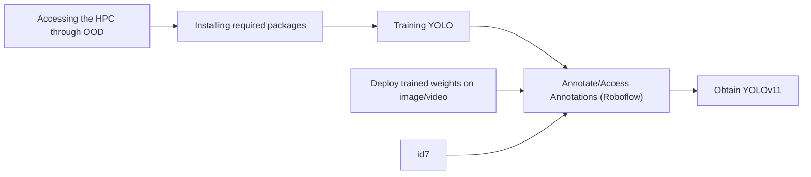

https://github.com/CosiMichele/workshop-materials/blob/main/2025/2501-FOSS-AI_series/01_Foundations_tools.md

https://github.com/CosiMichele/workshop-materials/blob/main/2025/2501-FOSS-AI_series/02_AI_in_OS.md

https://github.com/CosiMichele/workshop-materials/blob/main/2025/2501-FOSS-AI_series/04_images_cnn.md

https://github.com/CosiMichele/workshop-materials/blob/main/2025/2501-FOSS-AI_series/05_images-vids_cnn.md

https://github.com/CosiMichele/workshop-materials/blob/main/2025/2501-FOSS-AI_series/06_bringitalltogether.md

# Exploring Analysis  Platforms and High-Performance Computing Resources for Bioinformatics 

<br>
<br>
<p align="center">
    
</p>
<br>

---
>[!important]
> :clock1: **Schedule**
> - 2:30pm-2:15pm: Welcome, overview and housekeeping 
> - 2:15pm-2:45pm: The moving parts of FOSS and The Role of AI in Open Science
> - 2:45pm-3:00pm: Break
> - 3:00pm-4:00pm:
> - 4:00pm-4:30pm: Launching sessions

>[!important]
> :white_check_mark: **Expected Outcomes**
> - Connecting to remote platforms
> - Understanding the structure and navigating an HPC system
> - Learning basic HPC commands and job submissions

<br>

---
---

## The moving parts of Functional Open Science

Today's goals are to provide attendees with the fundamental knowledge of Open Science and the impact of AI/ML in the field.

As science evolves, scientists are pushed to collaborate in a more transparent fashion (some may even say *pushed* in this direction). Collaborations and transparency are pillars to Open Science, and are becoming requirements with major scientific grants requiring for submissions to have a clear Data/Project Management Plan *before* applying. Additionally, scientific journals such as Nature, PLOS and Science require you to share code and data (if possible) prior to publication.

Thus, it is fundamental for scientists to understand ***what*** Open Science is and ***how*** to best approach today's best practices.

In this workshop series, we aim to educate and introduce the basics of Open Science and AI/ML, reinforcing the learning material through a small functional Open Science friendly AI workflow, applying all that we will be learning through the series. 

In this session we will cover the following:
- Open Science 
- Version Control 
- Reproducibility

---

## Open Science

<p align="center">
    
</p>

Open Science Word Cloud by [*Pownall et al. 2023*](http://dx.doi.org/10.31234/osf.io/vypkb).

The definition of Open Science is not written in stone, making it a topic that may be up to the people to be interpreted. However, there are some attemps at a global definition:

***"Open Science is transparent and accessible knowledge that is shared and developed through collaborative networks"*** - [Vincente-Saez & Martinez-Fuentes 2018](https://linkinghub.elsevier.com/retrieve/pii/S0148296317305441)

or 

***"Open Science is a collaborative and transparent approach to scientific research that emphasizes the accessibility, sharing, and reproducibility of data, methodologies, and findings to foster innovation and inclusivity"*** -ChatGPT

In principle Open Science refers to a set of approaches that would ensure your science to be **transparent**, **collaborative** and **reproducible**.

Obviously, different fields of research have different standardized procedures for experimentation, however oftentimes tools and resources are shared across fields. For example:

- **Need to scale your research?** Scientists can use the [High Performance Computing](https://hpc.arizona.edu/) (HPC) platform or [JetStream2](https://jetstream-cloud.org/index.html) (which we will cover later in the series).
- **Need to share or "save your code"?** [GitHub](https://github.com/) (or [GitLab](https://about.gitlab.com/)) is (are) there for you!
- **Need to make your code reproducible for collaborators (or your future self)?** [Conda](https://docs.anaconda.com/anacondaorg/user-guide/) and [Container technology](https://www.docker.com/) are the current gold standard.

### The Present State of Science

Similar to governmental and other official procedures, the field of science is guided by the outcomes: grants are awarded to groups that have submitted successful proposals, funds are used for research, and the research finds are used to bolster the credibility of the funding agency.

In a sense, ***science is a business***.

Like many businesses, science adapts to the latest trends, and making science Open is latest goal for this cycle.

There are numerous reasons why making science Open is a positive goal:
1. **Accelerates Innovation and Discovery**:
    - Open science allows researchers worldwide to access data, tools, and publications freely. This reduces duplication of effort, fosters collaboration, and speeds up the pace of innovation. Scientists can build on each other’s work more effectively, leading to breakthroughs in less time.
2. **Improves Reproducibility and Credibility**:
    - Sharing data, methodologies, and results openly ensures that studies can be independently verified and reproduced. This strengthens the credibility of scientific findings and reduces instances of irreproducible or questionable research.
3. **Democratizes Knowledge Access**:
    - Open science removes barriers like paywalls, making knowledge accessible to researchers, educators, students, and the general public, regardless of their financial or institutional resources. This promotes equity in learning and research opportunities.
4. **Enhances Public Trust in Science**:
    - When research is transparent and openly shared, it becomes easier for the public to see how conclusions are reached. This fosters trust in scientific processes and can help counter misinformation and skepticism.
5. **Addresses Real-World Problems More Effectively**:
    - Open access to research enables governments, non-profits, and industry to quickly adopt scientific findings to address societal challenges such as climate change, public health crises, and technological advancement. It empowers citizens and organizations to contribute to solutions in meaningful ways.

Furthermore, Open Science (or making science Open) follows a framework that funding agencies are implementing in order for researchers to obtain grants: the Research Life Cycle.

<p align="center">
    
</p>

The Research Life Cycle from [Open Science Framework](https://osf.io/).

As graduate students, staff and faculty, we are often "forced" to work within a few blocks of the Research Life Cycle. For example, a Data Scientist might be asked to help to collect, store and analyze data whilst a faculty member might be the one driving the research ideas and writing a final report.

We all play a role in the Research Life Cycle, even without us knowing. Often, we find ourselves questioning what we are doing and why we are doing it -- the figure above helps us remind what the big picture is.

>[!note]
> :question: **Last but not least...**
> 
> [... the National Science Foundation (NSF) is pushing to make all publication using taxpayer's money to become open and accessible by 2026.](https://new.nsf.gov/public-access)
> This process requires the use of the framework shown above in the proposals, requiring clear Data Management Plans, detailed list of personnel, collaborations, and material handling.

> **It is of utmost importance that us as scientists understand these requirements to become successful.**

---
---

## The Importance of Version Control

<p align="center">
    
</p>

We have all been here, taken by the [Software Carpentry Version Control lesson](https://swcarpentry.github.io/git-novice/01-basics.html).

**Version Control** (VC) refers to keeping track of the version of a file, set of files, or a whole project. VC is as much a philosophy as a set of tools; you don't need to master [Git](https://git-scm.com/) to utilize version control (though it is certainly a worthwhile tool for many researchers).

<p align="center">
    
</p>

The version control path sofware takes before release, from [Cadence](https://resources.pcb.cadence.com/blog/what-is-a-version-control-system).

### What the *Git*?

<p align="center">
    
</p>

Git vs GitHub, simplified, from [Devmountain](https://devmountain.com/blog/git-vs-github-whats-the-difference/).

**Git** is a command-line program for version control of repositories. It keeps track of changes you make to files in your repository and stores those changes in a .git folder in that repository. These changes happen whenever you make a **commit**. Git stores the history of these commits in a "tree", so you can go back to any previous commit. By keeping track of the **differences** between commits, Git can be much more efficient than storing an entire copy of each version in a document's history.

You could utilize Git completely on its own, on your local computer, and get a lot of benefits. You will have a history of the changes you made to a project, allowing you to go back to any old version of your work. However, where Git really shines is in collaborative work. In order to effectively collaborate with others on a project, you need two basic features: a way to allow people to work in parallel, and a way to host repositories somewhere where everyone can access them. The first feature is **branching**, which is part of Git, and the hosting part can be taken care of by platforms like GitHub, GitLab, or Bitbucket. We will focus on GitHub.

GitHub is a site that can remotely host your Git repositories. By putting your repository onto GitHub, you get a backup of the repository, a way to collaborate with others, and a lot of other features.

- **Git**:
    - First developed in 2005, git is a version control software that allows users to make changes and add versions to their code.
    - Changes and versions are saved locally.
    - Accessible through the Shell.

- **GitHub**:
    - First launched in 2008, its main focus is hosting and sharing code.
    - Uses Git version control software.
    - Changes and versions are saved online (requires an account).
    - Mainly administered through the web (it also has a desktop app).
    - Acquired by Microsoft in 2018.

Here is a great visualization of the Git workflow:

<p align="center">
    
</p>

Visualizing the commands through a workflow example
(graphic's correction: ~~marged~~ merged), from [C#Corner](https://www.c-sharpcorner.com/article/git-and-github-version-control-local-and-remote-repository/).

---
---

## Reproducibility

<p align="center">
    
</p>

Source: Peng, *RD Reproducible Research in Computational Science Science* (2011): 1226–1227 via [*Reproducible Science Curriculum*](http://reproducible-science-curriculum.github.io/bosc2015/#/15).

As mentioned throughout today's session, Reproducibility is a key aspect of Open Science. There is no single method to achieve complete reproducibility, as it is a tast that requires diligence, attention and committment. As shown in the graph above, there is a spectrum to Reproducibility. One should *try* to produce a well Reproducible work, but not always it is *necessary* to be on the right side of the spectrum (those are the "unicorn" papers!). Where do you stand on the Reproducibility spectrum?

Thi section is going to cover 3 methods to help you achieve/improve Reproducibility:

- [Software Environments & Conda](#software-environments--conda)
- [Containers](#containers)

### Software Environments & Conda

Running a pipeline or a workflow constitutes using a number of different programs, tools and software. Often, these software may run only if of a specific version. To ensure that the pipeline runs, one should specify installing the program/software with the right version.

To help with this, we introduce the use of an **Environment Manager** called [**Anaconda** (or **Conda**)](https://docs.conda.io/en/latest/). An Environment Manager allows you to create software installation directories that are isolated from other installations. You can create unique environments and install specific software version to run specific scripts.

Conda is a popular and open source environment manager tool that can be installed on any operating system (Windows, MacOS, Linux).

Users can create environments that have their own set of packages, dependencies, and even their own version of Python.
Another piece of information that's important to remember is that projects can have their own specific requirements, often requiring different versions of the same software. Conda can help you create isolated environments to help softaware not interfering with each other, thus allows for consistent and reproducible results across different systems and setups.

<p align="center">
    
</p>

Conda, Miniconda, and Anaconda. [Taken from Getting Started with Conda, Medium](https://medium.com/hydroinformatics/getting-started-with-conda-environment-332182d1e937).

---

### Containers

<p align="center">
    
</p>

Sharing your scientific analysis code with your colleagues is an essential pillar of Open Science that will help push your field forward.

As disscussed, there are technical challenges that may prevent your colleagues from effectively running your code on their computers, issues related to computing environments.

A solution is to package up the code and all of the software and send it to your colleague as a **Container**.

A container is a standard unit of software that packages up code and all its dependencies so the application runs quickly and reliably from one computing environment to another

- Container images are a lightweight, standalone, executable package of software that includes everything needed to run an application: code, runtime, system tools, system libraries and settings
- Each of these elements are specifically versioned and do not change
- The recipient does not need to install the software in the traditional sense

A useful analogy is to think of software containers as shipping containers. It allows us move cargo (software) around the world in standard way. The shipping container can be offloading and executed anywhere, as long the destination has a shipping port (i.e., Docker)

<p align="center">
    
</p>

Difference between Virtual Machines and Containers. Containers are a lot more portable as these do not require an OS to be bundled with the software. Figure source: [Microsoft Cloudblogs](https://cloudblogs.microsoft.com/opensource/2019/07/15/how-to-get-started-containers-docker-kubernetes/).

Containers are similar to virtual machines (VMs), but are smaller and easier to share. A big distinction between Containers and VMs is what is within each environment: VMs require the OS to be present within the image, whilst containers rely on the host OS and the container engine (e.g., Docker Engine).

Software containers, such as those managed by Docker or Singularity, are incredibly useful for reproducible science for several reasons:

- **Environment Consistency**:¶
    - Containers encapsulate the software environment, ensuring that the same versions of software, libraries, and dependencies are used every time, reducing the "it works on my machine" problem.
- **Ease of Sharing**:
  - Containers can be easily shared with other researchers, allowing them to replicate the exact software environment used in a study.
- **Platform Independence**:
  - Containers can run on different operating systems and cloud platforms, allowing for consistency across different hardware and infrastructure.
- **Version Control**:
  - Containers can be versioned, making it easy to keep track of changes in the software environment over time.
- **Scalability**:
  - Containers can be easily scaled and deployed on cloud infrastructure, allowing for reproducible science at scale.
- **Isolation**:
  - Containers isolate the software environment from the host system, reducing the risk of conflicts with other software and ensuring a clean and controlled environment.

<p align="center">
    
</p>

The container's life cycle. Figure source: [Tutorialspoint](https://www.tutorialspoint.com/docker/index.htm).

---
---

## The role of AI in Open Science

<br>
<br>
<p align="center">
    
</p>
<br>

Source: [UNESCO](https://www.unesco.org/en/articles/exploring-opportunities-and-challenges-intersection-open-science-and-artificial-intelligence)

"While AI represents rapid scientific advances, its integration must align with open science principles to ensure replicability, credibility, equity and trustworthiness. Open science offers mutual benefits for AI by expanding participation in research and promoting inclusive practices. The open science approach, when combined with AI technologies, can significantly contribute to addressing the current pressing global threats." - [Blurb of UNESCO event "Navigating the Intersection of Open Science and AI: Exploring Opportunities and Challenges in the Era of Artificial Intelligence"](https://www.unesco.org/en/articles/exploring-opportunities-and-challenges-intersection-open-science-and-artificial-intelligence), held in June 2024.

All eyes of the world are pointed towards the new shiny object in the room: Artificial Intelligence. A fundamentally beautiful technology that is shaking the world of science (and education, economics, politics and jurisdiction amongst others) from the inside out.

Open Science is being heavily impacted, in aspects that we are gonig to be discussing today. As AI is a field that is currently seeing exponenital growth, we focus on questions, topics and aspects that AI/ML plays a role in:

- [The role of AI in Open Science](#the-role-of-ai-in-open-science)
  - [Overview](#overview)
  - [The Role of AI in Automated Research and Discovery](#the-role-of-ai-in-automated-research-and-discovery)
  - [AI’s Impact on Research Accessibility and Collaboration](#ais-impact-on-research-accessibility-and-collaboration)
  - [The Ethics of AI-Generated Scientific Knowledge](#the-ethics-of-ai-generated-scientific-knowledge)


Today's workshop will be carried out in a discussion fashion, with experts in the field sharing their knowledge on how AI is impacting Open Science.

---

### Discussion point 1: The Role of AI in Automated Research and Discovery

<br>
<br>
<p align="center">
    
</p>
<br>

Source: [A. Ur Rehman *et al.*, **Role of Artificial Intelligence in Revolutionizing Drug Discovery**, *Science Direct*, May 2024](https://www.sciencedirect.com/science/article/pii/S266732582400205X)

---

### Discussion point 2: AI’s Impact on Research Accessibility and Collaboration

<br>
<br>
<p align="center">
    
</p>
<br>

Source: [S. Paek & N. Kim, **Analysis of Worldwide Research Trends on the Impact of Artificial Intelligence in Education**, *MDPI*, June 2021](https://www.mdpi.com/2071-1050/13/14/7941)

---

### Discussion point 3: The Ethics of AI-Generated Scientific Knowledge

<br>
<br>
<p align="center">
    
</p>
<br>

Source: [N. Naik *et al.*, **Legal and Ethical Consideration in Artificial Intelligence in Healthcare: Who Takes Responsibility?**, *Frontiers in Surgery*, March 2022](https://www.frontiersin.org/journals/surgery/articles/10.3389/fsurg.2022.862322/full)

---
---

## Setting Up Your Own AI Pipeline

<br>
<br>
<p align="center">
    
</p>
<br>

## Computer Vision Tasks

Generally, we want to automate the derivation of useful information from images. Some example tasks include:
- **Classification**: given an image, predict a class label
- **Object detection**: generate a bounding box around the object
- **Semantic segmentation**: assign every pixel in the image a class label
- **Instance segmentation**: differentiate between multiple instances of the same semantic class
- **Pose recognition**: for example, estimating the pose of a head, which can be used to determine what they are looking at
- **Activity recognition**: related to pose recognition, classify a pose or series of poses
- **Object tracking**: propose correspondence of detected objects across frames of a video
- **Image restoration**
- **Feature matching**: detection of features and correspondence between multiple views

---

## CNN Architecture

<br>
<br>
<p align="center">
    
</p>
<br>

Traditional image analysis approaches such as looking at color values of individual pixels or grouping adjacent pixels based on similar values (i.e., objects), will both likely to fail at the task of identifying objects in high-resolution images.

A convolutional neural network (CNNs) can be trained to identify objects in an image more analogously to how humans can identify objects. We generally look at multiple features of an object to decide what the object is. For example, if presented with an image of a tree, we may look at features such as crown shape, leaf architecture, and color to help us identify the object as a tree.

Please watch these VERY useful videos to understand how Convolutional Neural Networks operate:

- [*What are Convolutional Neural Networks (CNNs)?*](https://www.youtube.com/watch?v=QzY57FaENXg) from IBM Technology
- [*But what is a neural network?*](https://www.youtube.com/watch?v=aircAruvnKk&list=PLZHQObOWTQDNU6R1_67000Dx_ZCJB-3pi) from 3Blue1Brown (*highly recommended!!*)
- [*How Convolutional Neural Networks Work*](https://www.youtube.com/watch?v=FmpDIaiMIeA) from Brandon Rohrer
- [*Convolutional Neural Networks Explained (CNN Visualized)*](https://www.youtube.com/watch?v=pj9-rr1wDhM) from Futurology

In this workshop, we will use RGB images. Each image has dimensionality H x W x 3, where H is the height of the image, W is the width of the image, and every pixel has three color channels (Red, Green, Blue).

To motivate the need for a neural network architecture for images, consider the case of classifying digits with [MNIST](https://en.wikipedia.org/wiki/MNIST_database) (Modified [National Institute of Standards and Technology](https://en.wikipedia.org/wiki/National_Institute_of_Standards_and_Technology) database) using a fully connected neural network. In this case each pixel takes on only a single greyscale value, and thus the image has H x W values. In the fully connected neural network, we unravel the image into a one dimensional vector which is HW long, either by picking values row-wise or column-wise. 

<br>
<br>
<p align="center">
    
</p>
<br>


Despite both images having the same structure, the location of the white value is shifted in the vector, meaning it interacts with a completely different set of weights and biases. This is a toy example of a larger problem. For a classification example, we would like to learn to identify an image that features a cat, whether the cat is in the upper left or the lower right of the image. This property is known as [translation invariance](https://stats.stackexchange.com/questions/208936/what-is-translation-invariance-in-computer-vision-and-convolutional-neural-netwo). Convolution is the linear operator that enables this in CNNs.

<br>
<br>
<p align="center">
    
</p>
<br>


Convolutional neural network architectures consist of convolutional and pooling layers in addition to fully connected layers. Note that we use a common activation function, ReLU. Based on the output of the fully connected layers, we are performing a classification task between some number of classes. Note also that the network reduces the dimensionality of the input using the convolution and pooling layers to some compact representation, and then feeds this into the fully connected layers which will generate the predicted class.

---

### Convolution

In the convolution operation, we pass kernels (also known as filters) over an image. We take the inner product between the kernel and a patch of the image. The output of convolution is high where the underlying image resembles the filter, and low where it does not. Once this response is calculated, it is fed through an activation function like ReLU, similar to fully connected neural networks.

<br>
<p align="center">
    
</p>
<br>
<p align="center">
    
</p>
<br>
<p align="center">
    
</p>
<br>

Before neural networks there was significant effort expended to design kernels to detect small features, such as edges, corners, etc and use these for computer vision tasks. Neural networks allow us to set up a convolutional architecture that both learns the kernels that are useful for the given task as well as the mapping from the feature space to the output - i.e. the network learns the parameters of each kernel.

Here's an example of the learned filter bank of ImageNet (Krizhevsky et al.). Note that some of the filters are what we would expect: the network has learned to look for lines at various angles, as well as for dots. Not all of the filters are easily interpretable.


In addition to specifying the number of filters and the shape of the filters, we also need to specify the stride and padding. The stride specifies how many pixels the kernel shifts by as it slides around the input image. Using zero-padding, the image will add artificial black pixels in a border around the input.


---

### Pooling

These feature maps still have very high dimension, so we pool the filter activations through a pooling layer. This can be thought of as summarizing the input. In max pool, we take the maximum of all activations, and in average pool we take the average of all activations. Typically max pool is used. There are no learnable parameters for this layer.

<br>
<p align="center">
    
</p>
<br>
<p align="center">
    
</p>
<br>

---

### Parameter Sharing

In the AlexNet architecture, which represented a huge leap forward in image classification, input images are 227x227x3. The first convolutional layer output is 55x55x96 (290,400), so 96 filters must be learned. Each filter is 11x11x3, so we learn 11x11x3 weights and 1 bias for a total of 364 parameters per filter. Thus we need to learn 34,944 parameters in total for this convolutional layer.

If we used a fully connected neural network instead, we would go from 227x227x3 (154,587) -> 55x55x96 (290,400), which requires 154587*290400 weights and 290400 biases. That's approximately 44 billion parameters for a single layer!

Also note that by learning filters that are shared across all spatial locations in the image, we have achieved our goal of translation invariance.

---

### Activations

<br>
<p align="center">
    
</p>
<br>

Intuition: the first layers of the network learn low level, simple features. As the input progresses deeper into the architecture of the network, these are combined to create more complex features and eventually a high level semantic description of the image is extracted. This high level semantic description is then used in the fully connected network for the learning task.

---

## Scientific Applications

Object tracking has been an active fields for decades, but with Open Science becoming more prominent and with hardware becoming more affordable, open source code is now much easier to obtain and apply. 

For example, in the field of biology there are at least 2 software available to the pubic: [DeepLabCut](https://github.com/DeepLabCut/DeepLabCut) and [SLEAP](https://github.com/talmolab/sleap).

### [DeepLabCut]((https://github.com/DeepLabCut/DeepLabCut))

<br>
<p align="center">
    
</p>
<br>

DeepLabCut (DLC) is an open-source, deep-learning-based software designed for pose estimation. It enables researchers to track and analyze movements of animals in videos by detecting specific body parts without the need for physical markers.

It was inspired by the need for precise, automated tracking of animal behavior in neuroscience and behavioral research. The software is built upon [DeepLab](https://arxiv.org/abs/1606.00915) (Chen *et al.*, 2016), a deep-learning framework initially designed for image segmentation, utilizing ResNet (Residual Networks) as the backbone architecture. It employs transfer learning from pre-trained models on large image datasets, refining them with user-labeled frames for precise keypoint detection. DLC applies this framework to the problem of keypoint detection, allowing researchers to track body parts efficiently. [viso.ai has a quick rundown on what DeepLab is](https://viso.ai/deep-learning/deeplab/). 

DeepLabCut is widely used across various scientific fields, including:

- **Neuroscience** – Tracking animal movements to study motor functions and behavioral responses.
- **Biomechanics** – Analyzing motion and gait in animals and humans.
- **Ecology & Ethology** – Studying natural behaviors of animals in the wild or laboratory settings.
- **Medical & Rehabilitation Research** – Assessing motor impairments in preclinical models of neurological disorders.
- **Sports Science**– Analyzing human motion for performance improvement and injury prevention.
- **Human-Computer Interaction (HCI)** – Tracking human hand and facial movements for gesture recognition.

### [SLEAP](https://github.com/talmolab/sleap)

<br>
<p align="center">
    
</p>
<br>

SLEAP (Social LEAP Estimates Animal Poses) is an open-source deep-learning-based tool for multi-animal pose estimation. It is designed as an alternative to DeepLabCut (DLC) but focuses on handling multiple interacting animals more effectively.

In order to help tracking multiple objects, SLEAP uses a similar setup as DLC but also includes multiple network architectures for different use cases:

- **Top-down models**: first detecting the entire animal and then estimating its pose.
- **Bottom-up models**: directly detecting individual keypoints across all animals.
- Fully convolutional networks for segmentation-based approaches.
- **ResNet** and **HRNet** architectures for feature extraction and pose estimation.

---

## The Swiss Army Knife (Resources for the Bigger Picture)

This workshop covers the tools required for the FOSS-AI goal of creating a small live object recognition demo. Here are the libraries required (and additional tools you may want to track):

### [YOLO](https://arxiv.org/abs/1506.02640)

*Read the paper*: [You Only Look Once](https://arxiv.org/abs/1506.02640), Redmond *et al.*, 2015

<br>
<p align="center">
    
</p>
<br>

YOLO (You Only Look Once) is a detection algorithm known for its speed and accuracy. Unlike traditional object detection methods that use sliding windows or region proposals, YOLO processes an image in a single forward pass, making it significantly faster. The goal was to create an object detection model that could work in real-time, unlike region-based models such as R-CNN or Faster R-CNN, which were slower.

Quoting [DataCamp](https://www.datacamp.com/blog/yolo-object-detection-explained): "*The authors frame the object detection problem as a regression rather than a classification task by spatially separating bounding boxes and associating probabilities to each detected image using a single convolutional neural network (CNN).*"

Additional Resource: [What is YOLO algorithm
, Medium](https://medium.com/@ishudey11032002/what-is-yolo-algorithm-ef5a3326510b).

### [Ultralytics](https://docs.ultralytics.com/quickstart/#install-ultralytics)

<br>
<p align="center">
    
</p>
<br>

Ultralytics is a company that develops and maintains the YOLO algorithms. We are going to be using Utralytics in order to train and run the YOLO models, as scripts and commands they have created do the heavy lifting.

One can install Ultralytics on their machine using

```
pip install ultralytics
```

or through conda

```
conda install -c conda-forge ultralytics
```

>[!important]
> :heavy_exclamation_mark: **Important!**
> For YOLO and Ultralytics to work as intended, one should have **[PyTorch](https://pytorch.org/)** installed.

### [Gradio](https://www.gradio.app/) 

<br>
<p align="center">
    
</p>
<br>

Python library facilitating creating web apps to interface with an AI model.

Install with

```
pip install --upgrade gradio
```

### [OpenCV](https://pypi.org/project/opencv-python/)

<br>
<p align="center">
    
</p>
<br>

OpenCV (Open Source Computer Vision Library) is a high-performance computer vision and image processing library. It provides tools for image manipulation, video analysis, object detection, and feature extraction.

In our case, it helps with creating visual output from interfacing with an AI model. Generates videos and images. Can also support webcam input for real-time AI.

```
pip install opencv-python
```

---

## Annotations

Annotations are essential for training machine learning models. Here are two resources that you can use for annotating a dataset.

### [Roboflow](https://app.roboflow.com/) 

<br>
<p align="center">
    
</p>
<br>

Roboflow is a computer vision platform that helps users annotate, preprocess, and train object detection and classification models without requiring deep technical expertise. It's a website allowing image annotation, you can export the annotations for AI training for a number of formats (e.g., YOLO). Proprietary and requires a free account.

### [Label Studio](https://labelstud.io/) 

<br>
<p align="center">
    
</p>
<br>

Open source image annotation, can also export image annotations in various formats.

---

**Additional Resources**:

- segment anything: https://segment-anything.com/
- [Follow this quick tutorial on running segment anything on your computer](https://www.hackster.io/lurst811/realtime-language-segment-anything-on-jetson-orin-ccf6e1)

---
---

## Bringing it All Together

Over the course of this and the next segment we are going to take all of the Open Science pieces we have discussed through today and create and end-to-end ML pipeline that will recognize objects within a photo or a video.

As a summary, here are the contents that we have covered and we are going to be using today:

- [Virtual Environments](https://docs.python.org/3/library/venv.html) (through Python)
- [Where to find compute](https://docs.jetstream-cloud.org/) (through the HPC)
- Open Source ML libraries ([YOLO](https://docs.ultralytics.com/models/yolo11/)/[Ultralytics](https://docs.ultralytics.com/))
- Tools to build annotations for training, testing and deploying an ML object detector (through [Roboflow](https://roboflow.com/) (requires account)) 

Here's the general overview of what we are going to be doing today:



---


### Environment Setup

**[Ultralytics](https://docs.ultralytics.com/quickstart/#install-ultralytics)**

<br>
<p align="center">
    
</p>
<br>

Ultralytics is a company that develops and maintains the YOLO algorithms. We are going to be using Utralytics in order to train and run the YOLO models, as scripts and commands they have created do the heavy lifting.

One can install Ultralytics on their machine using

```
pip install ultralytics
```

or through conda

```
conda install -c conda-forge ultralytics
```

>[!important]
> :heavy_exclamation_mark: **Important!**
> For YOLO and Ultralytics to work as intended, one should have **[PyTorch](https://pytorch.org/)** installed.

**[OpenCV](https://pypi.org/project/opencv-python/)**

<br>
<p align="center">
    
</p>
<br>

OpenCV (Open Source Computer Vision Library) is a high-performance computer vision and image processing library. It provides tools for image manipulation, video analysis, object detection, and feature extraction.

In our case, it helps with creating visual output from interfacing with an AI model. Generates videos and images. Can also support webcam input for real-time AI.

```
pip install opencv-python
```

>![Note]
> Other packages required to execute workflow are [`torch`](https://pytorch.org/get-started/locally/), [`notebook`](https://jupyter.org/), [`ipykernel`](https://pypi.org/project/ipykernel/), [`numpy`](https://numpy.org/), [`vlc`](https://www.videolan.org/vlc/).
> - torch: A deep learning framework for tensor computations and neural networks, developed by Meta.
> - (Jupyter) notebook: A web-based interactive environment for writing and running code, primarily used for Jupyter notebooks.
> - numpy: A fundamental package for scientific computing in Python, providing support for large, multi-dimensional arrays and matrices.

Most of these can be installed in a single liner:

```
pip install torch numpy notebook opencv-python numpy ultralytics
```

### Obtaining YOLOv11

By navigating the Ultralytics website, we find a list of models we can download: https://docs.ultralytics.com/models/yolo11/. We want YOLOv11 for Detection.

We can download that by using `wget`

```
wget https://github.com/ultralytics/assets/releases/download/v8.3.0/yolo11n.pt
```

This is the model we are going to use for training and testing.

---

## Annotations and Training

Here you can find bean images that have already been annotated: https://universe.roboflow.com/test-fdsxz/beans-dijdm/dataset/1

1. Log in and click "download YOLOv11"
2. Download dataset
3. YOLOv11 format
4. Download zip to computer
5. Decompress with `unzip <file.zip>`
6. `cd` into folder

### Training 

We could use a Jupyter Notebook for this, but it is quicker to do so using the command line. Firstly, make sure that `yolo1n.pt` is in the same folder as the unzipped annotations. You will need the `data.yaml` file as this will point to where the annotations JSONs are.

Train YOLO with

```
yolo detect train data=data.yaml model=yolo11n.pt epochs=100 imgsz=640
```

You will notice that a new folder is created: `runs`. This folder contains the weights that we require for deployment.

To make things easier, we want to copy `runs/detect/train3/weights/best.pt` to our home folder.

```
`cp runs/detect/train3/weights/best.pt ~/`
```

---

## Deploy

These two scripts are meant to be executed using python, but we can open them up using notebook to understand how each of the packages are used.

### Images

```python
import cv2
from ultralytics import YOLO

def predict_and_detect(chosen_model, img, classes=[], conf=0.5, rectangle_thickness=2, text_thickness=1):
    results = predict(chosen_model, img, classes, conf=conf)
    #count variable keeps track of total objects detected by the model (optional functionality)
    count=0
    
    #for each individual detection, draw a rectangle bounding box and title of the detected object
    for result in results:
        for box in result.boxes:

            #rectangle method needs coordinates of the two corners of the rectangle you need drawn
            #https://www.geeksforgeeks.org/python-opencv-cv2-rectangle-method/
            #box.xyxy holds pixel coordinates in a 2d list and are used as points to draw the rectangle
            cv2.rectangle(img, (int(box.xyxy[0][0]), int(box.xyxy[0][1])),
                          (int(box.xyxy[0][2]), int(box.xyxy[0][3])), (255, 0, 0), rectangle_thickness)
            
            #Create text above the generated box that prints the class name
            cv2.putText(img, f"{result.names[int(box.cls[0])]}",
                        (int(box.xyxy[0][0]), int(box.xyxy[0][1]) - 10),
                        cv2.FONT_HERSHEY_PLAIN, 1, (255, 0, 0), text_thickness)
            count += 1

    #creates box and text in output image displaying the total cow count
    cv2.rectangle(img, (10, 5), (165, 50), (0,0,0), -1)
    cv2.putText(img, f"BEANS: {count}", (10,35), cv2.FONT_HERSHEY_PLAIN, 2, (255, 255, 255), 2)

    #return edited frame (img) containing bounding boxes
    return img, results

# Load YOLO model
model = YOLO("best.pt")

# Path to input image
image_path = r"<image.png>"

# Read the image
img = cv2.imread(image_path)

if img is not None:
    # Process the image
    result_img, _ = predict_and_detect(model, img, classes=[], conf=0.5)
    
    # Save the processed image
    output_image_filename = "output_image.jpg"
    cv2.imwrite(output_image_filename, result_img)
    print(f"Saved: {output_image_filename}")
else:
    print("Failed to read the image file.")

# Release resources
cv2.destroyAllWindows()
```

### Videos

```python
import cv2
from ultralytics import YOLO

#OVERVIEW: The yolo model detects objects in a single frame, these detections are used to draw the actual boxes on top of the input frame
#          and write them to a new mp4 file. Rinse and repeat for the entire input video

#Branches yolos predict method based on weather classes are provided
def predict(chosen_model, img, classes=[], conf=0.5):
    if classes:
        results = chosen_model.predict(img, classes=classes, conf=conf)
    else:
        results = chosen_model.predict(img, conf=conf)

    #results are a list of attributes like boxes, masks, etc https://docs.ultralytics.com/modes/predict/#working-with-results
    return results

def predict_and_detect(chosen_model, img, classes=[], conf=0.5, rectangle_thickness=2, text_thickness=1):
    results = predict(chosen_model, img, classes, conf=conf)
    #count variable keeps track of total objects detected by the model (optional functionality)
    count=0
    
    #for each individual detection, draw a rectangle bounding box and title of the detected object
    for result in results:
        for box in result.boxes:

            #rectangle method needs coordinates of the two corners of the rectangle you need drawn
            #https://www.geeksforgeeks.org/python-opencv-cv2-rectangle-method/
            #box.xyxy holds pixel coordinates in a 2d list and are used as points to draw the rectangle
            cv2.rectangle(img, (int(box.xyxy[0][0]), int(box.xyxy[0][1])),
                          (int(box.xyxy[0][2]), int(box.xyxy[0][3])), (255, 0, 0), rectangle_thickness)
            
            #Create text above the generated box that prints the class name
            cv2.putText(img, f"{result.names[int(box.cls[0])]}",
                        (int(box.xyxy[0][0]), int(box.xyxy[0][1]) - 10),
                        cv2.FONT_HERSHEY_PLAIN, 1, (255, 0, 0), text_thickness)
            count += 1

    #creates box and text in output image displaying the total cow count
    cv2.rectangle(img, (10, 5), (165, 50), (0,0,0), -1)
    cv2.putText(img, f"BEANS: {count}", (10,35), cv2.FONT_HERSHEY_PLAIN, 2, (255, 255, 255), 2)

    #return edited frame (img) containing bounding boxes
    return img, results

# defining function for creating a writer (for mp4 videos)
def create_video_writer(video_cap, output_filename):

    # grab the width, height, and fps of the frames in the video stream.
    frame_width = int(video_cap.get(cv2.CAP_PROP_FRAME_WIDTH))
    frame_height = int(video_cap.get(cv2.CAP_PROP_FRAME_HEIGHT))
    fps = int(video_cap.get(cv2.CAP_PROP_FPS))

    # initialize the FourCC and a video writer object
    fourcc = cv2.VideoWriter_fourcc(*'MP4V') #mp4 file format
    writer = cv2.VideoWriter(output_filename, fourcc, fps,
                             (frame_width, frame_height))

    #return writer has .write method to "write" individual frames of new video with bounding boxes, based on the info outlined above
    return writer

model = YOLO("best.pt")

output_filename = "out.mp4"

video_path = r"<video>.mp4"

#cv2 video stream to run the model against
cap = cv2.VideoCapture(video_path)
writer = create_video_writer(cap, output_filename)

while True:
    success, img = cap.read()
    
    #logic to end loop when video finishes
    if not success:
        break

    #get prcocessed frame and write it into output video file
    result_img, _ = predict_and_detect(model, img, classes=[], conf=0.5)
    writer.write(result_img)

    #show live progress of video writing
    cv2.imshow("Image", result_img)
    
    cv2.waitKey(1)
writer.release()
```

## Sources for images and additional resources

- DataLab Machine Learning Workshop series (2024): [Convoultional Neural Networks](https://github.com/ua-datalab/MLWorkshops/wiki/Convolutional-Neural-Networks)
- DataLab Geospatial Workshop series (2024): Image Object Detection ‐ [Deep Forest](https://github.com/ua-datalab/Geospatial_Workshops/wiki/Image-Object-Detection-%E2%80%90-Deep-Forest) and [Detecto](https://github.com/ua-datalab/Geospatial_Workshops/wiki/Image-Object-Detection-%E2%80%90-Detecto)
- [Stanford's CS231n, CNNs for Visual Recognition](https://cs231n.github.io/) An excellent resource for neural networks as well as CNNs
- [ConvNetJS CIFAR-10](https://cs.stanford.edu/people/karpathy/convnetjs/demo/cifar10.html) Train and test a model on CIFAR10 in your browser. Excellent demonstration of the activations at every step in the architecture.
- [Comprehensive Guide to Convolutional Neural Networks - the ELI5 way](https://towardsdatascience.com/a-comprehensive-guide-to-convolutional-neural-networks-the-eli5-way-3bd2b1164a53)
- [A guide to convolution arithmetic for deep learning](https://arxiv.org/abs/1603.07285) A thorough overview of convolution, stride, and padding
- [Introduction to CNN](https://github.com/nextgensh/ua-teaching/blob/main/cnn/cnn-intro.ipynb). Shravan Aras.

---
---